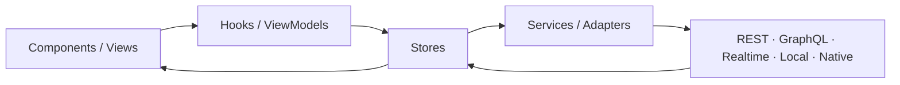

# Prometheus Entity Management

**One entity graph. Every framework. Realtime everywhere.**

Prometheus Entity Management is a normalized, globally reactive entity graph
for web, mobile, desktop, realtime, and local-first applications. Each entity
lives once at a `type + id` address. Queries populate the graph, lists keep
ordered IDs, and every view resolves the current canonical entity plus an
explicit local patch. A single write therefore updates list rows, detail panels,
relationships, badges, and policy-controlled generated UI without maintaining
parallel query caches.

## 3.0 release status

**3.0.1 stable is published.** All twelve npm packages are public at `3.0.1`
with the `latest` tag promoted (published 2026-08-23). `3.0.0` was withdrawn
the same day: its manifests shipped an unresolved pnpm `workspace:` protocol
and could not be installed, so the broken `3.0.0` versions are deprecated and
`3.0.1` is the stable line. Flutter is public on pub.dev as
`entity_graph_flutter@3.0.0`.
The production documentation is available at
[prometheus-ags.github.io/prometheus-entity-management](https://prometheus-ags.github.io/prometheus-entity-management/).

<!-- BEGIN GENERATED:RELEASE_TAGS -->
Registry snapshot: 2026-08-23T18:45:00Z. Expected candidate: `3.0.1`.

| Package | `latest` | `alpha` | `next` | Release state |
| --- | --- | --- | --- | --- |
| `@prometheus-ags/entity-graph-core` | `3.0.1` | `3.0.0-alpha.0` | `3.0.0-rc.1` | published |
| `@prometheus-ags/entity-graph-sdl` | `3.0.1` | `3.0.0-alpha.0` | `absent` | published |
| `@prometheus-ags/entity-graph-solid` | `3.0.1` | `3.0.0-alpha.0` | `absent` | published |
| `@prometheus-ags/entity-graph-svelte` | `3.0.1` | `3.0.0-alpha.0` | `absent` | published |
| `@prometheus-ags/entity-graph-sync` | `3.0.1` | `3.0.0-alpha.0` | `absent` | published |
| `@prometheus-ags/entity-graph-tauri` | `3.0.1` | `3.0.0-alpha.0` | `absent` | published |
| `@prometheus-ags/entity-graph-web-components` | `3.0.1` | `3.0.0-alpha.0` | `absent` | published |
| `@prometheus-ags/prometheus-entity-management` | `3.0.1` | `3.0.0-alpha.0` | `3.0.0-rc.1` | published |
| `@prometheus-ags/a2ui-react` | `3.0.1` | `3.0.0-alpha.0` | `3.0.0-rc.1` | published |
| `@prometheus-ags/entity-graph-a2a` | `3.0.1` | `3.0.0-alpha.0` | `absent` | published |
| `@prometheus-ags/entity-graph-alpine` | `3.0.1` | `3.0.0-alpha.0` | `absent` | published |
| `@prometheus-ags/entity-graph-htmx` | `3.0.1` | `3.0.0-alpha.0` | `absent` | published |
<!-- END GENERATED:RELEASE_TAGS -->

The stable release is tagged `v3.0.1` and was verified live against the public
registry after publication. See [RELEASING.md](RELEASING.md) for the release
contract, the governed OIDC promotion path, and recovery rules.

## Why an entity graph

- **One identity:** canonical data is stored once; lists never copy entities.
- **Cross-view reactivity:** every projection rejoins the same current entity.
- **Backend independence:** REST, GraphQL, WebSocket, Supabase, Flint, PGlite,
  and CRDT providers populate one graph.
- **Exact optimistic behavior:** local patches stay separate from canonical
  state and retain the previous state required for rollback.
- **Portable architecture:** React, Flutter, lightweight web bindings, Tauri,
  and agent protocols preserve the same state and trust boundaries.
- **Inspectable state:** entity, patch, list, checkpoint, and offline queue state
  live in explicit stores instead of UI components or opaque query containers.

## Architecture



**Components → Hooks/ViewModels → Stores → Services/Adapters → External
systems.** Components render state and submit intent. Hooks or view models
orchestrate store methods. Stores own application state. Services and adapters
own I/O, subscriptions, authentication boundaries, persistence, and external
protocols. Components never call the graph store or external services directly.

```text
entities[type][id]   canonical server-confirmed data
patches[type][id]    local/optimistic overlay, merged at read time
lists[queryKey].ids  order + pagination + fetch state, never entity copies
```

When `Task:42` changes, every list containing ID `42` and every detail or
relationship projection reads the same new Task. Queries remain population
instructions rather than competing data owners.

## Package chooser

Start with the framework-neutral core, then add only the binding or integration
packages your application needs. Bindings use an application-owned core peer so
they cannot create hidden graph singletons.

<!-- BEGIN GENERATED:PACKAGES -->
| Package | Candidate | Stability | Role |
| --- | --- | --- | --- |
| `@prometheus-ags/entity-graph-core` | `3.0.1` | stable | framework-neutral normalized graph |
| `@prometheus-ags/prometheus-entity-management` | `3.0.1` | stable | React 19 hooks and UI |
| `@prometheus-ags/entity-graph-sdl` | `3.0.1` | stable | schema definition language |
| `@prometheus-ags/entity-graph-sync` | `3.0.1` | stable | local-first and CRDT sync providers |
| `@prometheus-ags/entity-graph-svelte` | `3.0.1` | stable | Svelte 5 binding |
| `@prometheus-ags/entity-graph-solid` | `3.0.1` | stable | Solid binding |
| `@prometheus-ags/entity-graph-web-components` | `3.0.1` | stable | Lit web components |
| `@prometheus-ags/entity-graph-alpine` | `3.0.1` | stable | Alpine plugin |
| `@prometheus-ags/entity-graph-htmx` | `3.0.1` | stable | HTMX server adapter |
| `@prometheus-ags/entity-graph-a2a` | `3.0.1` | stable | A2A reference server |
| `@prometheus-ags/a2ui-react` | `3.0.1` | stable | A2UI React renderer and graph bridge after AG-UI migration |
| `@prometheus-ags/entity-graph-tauri` | `3.0.1` | stable | Tauri JavaScript binding and bundled Rust plugin |
<!-- END GENERATED:PACKAGES -->

Package-level READMEs remain the package-specific API sources. The generated
multi-package reference is produced from packed tarballs with TypeDoc packages
mode under `website/static/api/`, published at `/api/` on the documentation site.

## Quickstarts

### React 19 + Vite 8

Install the React package together with the matching core:

```bash
pnpm add @prometheus-ags/entity-graph-core \
  @prometheus-ags/prometheus-entity-management \
  react@19 react-dom@19
```

The example runs at `http://localhost:5173` and covers normalized list/detail
identity, optimistic confirmation and rollback, relationship invalidation,
local/remote/hybrid views, REST/GraphQL seams, realtime coalescing, PGlite,
Loro, Suspense, DevTools, and accessibility. See
[the React/Vite guide](website/docs/frameworks/react-vite.md).

### Flutter + Riverpod 3

Install the public Flutter package from pub.dev:

```bash
flutter pub add entity_graph_flutter:^3.0.0
```

<!-- BEGIN GENERATED:NATIVE_RELEASES -->
pub.dev snapshot: 2026-08-06T08:17:32Z.

| Package | Version | State | Published |
| --- | --- | --- | --- |
| [`entity_graph_flutter`](https://pub.dev/packages/entity_graph_flutter) | `3.0.0` | published | 2026-08-06T08:09:36.989835Z |

The published archive passed a clean consumer resolution, import, and analyzer check.
pub.dev does not yet associate the package with a verified publisher.
<!-- END GENERATED:NATIVE_RELEASES -->

Start with [the package README](packages/entity_graph_flutter/README.md) and
[Flutter/Riverpod guide](website/docs/frameworks/flutter-riverpod.md). The
example uses generated Riverpod families, optimistic/offline CRUD,
relationships, realtime invalidation, policy-gated GenUI, responsive layouts,
and an optional FFI transport.

## Frameworks, transports, and platforms

| Category | Supported 3.x surfaces |
| --- | --- |
| UI bindings | React 19, Flutter/Riverpod 3, Svelte 5, Solid, Alpine, Web Components, HTMX |
| Application runtimes | Vite 8, Next.js App Router, Tauri 2 desktop/Android/iOS |
| Transports | REST, GraphQL, WebSocket, Supabase Realtime, Flint Realtime Fabric |
| Local-first | PGlite persistence, Loro convergence, offline queues, reconnect recovery |
| Agent protocols | A2A JSON-RPC, official A2UI surfaces, default-deny action policy, optional human approval |
| Native seams | Tauri commands/events/capabilities, optional Flutter FFI transport |
| Schema/tooling | Entity SDL, generated declarations/providers, Rust CLI and MCP deliverables |

### Flint Realtime Fabric

`createFlintAdapter` translates `watchEntities` events into `ChangeSet` values,
then `RealtimeManager` coalesces graph writes. Tenant, channel, consumer,
checkpoint, offset, issuer, `kid`, JWKS, role, and key-separation boundaries are
explicit. `mutateEntity` publishes caller-owned mutations. Reconnect resumes
from an acknowledged checkpoint; service-role/Forge credentials never enter
client examples. The portable deterministic contract and live sibling-source
evidence are separate and fail closed. Read the
[Flint guide](website/docs/integrations/flint-guide.md).

## Example applications

All five applications use the shared Project/User/Task/Comment/Activity domain
and scenario contract. “Implemented” is bounded evidence, not a claim that all
npm packages, app stores, native signing, or stable npm promotion have occurred.

<!-- BEGIN GENERATED:EXAMPLES -->
| Example | Status | Source | Verification |
| --- | --- | --- | --- |
| react-19-vite-8 | implemented | [`examples/vite-app`](examples/vite-app/) | `pnpm run verify:vite-react19` |
| nextjs | implemented | [`examples/nextjs-app`](examples/nextjs-app/) | `pnpm run verify:nextjs-app-router` |
| agentic-a2ui | implemented | [`examples/agentic-a2ui-app`](examples/agentic-a2ui-app/) | `pnpm run verify:agentic-a2ui` |
| flutter-riverpod | implemented | [`examples/flutter-riverpod`](examples/flutter-riverpod/) | `pnpm run dart:ci` |
| tauri-desktop-mobile | implemented | [`examples/tauri-universal`](examples/tauri-universal/) | `pnpm run verify:tauri-universal` |
<!-- END GENERATED:EXAMPLES -->

## Capability and scenario coverage

Every stable capability maps to release artifacts, semantic scenarios,
executable examples, documentation, and evidence receipts in
[`examples/coverage.json`](examples/coverage.json).

<!-- BEGIN GENERATED:SCENARIOS -->
| Capability | Stability | Scenarios | Evidence status |
| --- | --- | --- | --- |
| Normalized entities and ID-only lists | stable | `example.graph.normalized-cross-view` | implemented |
| Local patches remain separate and globally visible | stable | `example.crud.optimistic-confirm`<br/>`example.crud.optimistic-rollback` | implemented |
| CRUD with optimistic confirm and rollback | stable | `example.crud.optimistic-confirm`<br/>`example.crud.optimistic-rollback` | implemented |
| Relationship traversal and cascade invalidation | stable | `example.relationship.cascade-invalidation` | implemented |
| Local remote and hybrid view completeness | stable | `example.view.local-remote-hybrid` | implemented |
| Realtime batching and cross-view updates | stable | `example.realtime.coalesced-cross-view` | implemented, partial |
| Offline persistence reconnect and convergence | stable | `example.offline.persistence-convergence` | implemented |
| REST and GraphQL normalization equivalence | stable | `example.transport.rest-graphql-equivalence` | implemented |
| One application-owned graph across JavaScript bindings | stable | `example.graph.normalized-cross-view` | implemented |
| A2A task and A2UI policy-controlled surface flow | stable | `example.protocol.a2a-a2ui-policy` | implemented |
| Per-request SSR graph isolation and hydration | stable | `example.runtime.ssr-isolation-hydration` | implemented |
| Tauri desktop and mobile adapter boundary | stable | `example.platform.adapter-boundary` | implemented |
| Flutter graph and Riverpod adapter boundary | stable | `example.platform.adapter-boundary` | implemented |
| SDL and generated artifact structural round-trip | stable | `example.schema.roundtrip` | partial |
| Engine lifecycle Suspense errors and diagnostics | stable | `example.runtime.lifecycle-security` | implemented |
| Tenant action approval and secret safety boundaries | stable | `example.runtime.lifecycle-security`<br/>`example.protocol.a2a-a2ui-policy`<br/>`example.platform.adapter-boundary` | implemented, planned |
<!-- END GENERATED:SCENARIOS -->

Browse the [allowlisted evidence gallery](website/docs/evidence/gallery.mdx).
Its generated manifest records scenario IDs, captions, alt text, source paths
and SHAs, receipts, dimensions, certification status, and SHA-256. Gallery
generation excludes failure diffs, blank captures, icons, bundles, internal
paths, and token-shaped content.

## Compatibility

| Runtime | Supported line | Notes |
| --- | --- | --- |
| Node.js | `^22.14.0`, `^24.0.0`, or `>=26.0.0` | npm libraries and documentation tooling |
| pnpm | `>=10.33.0 <12` | pnpm 10.33.0 is pinned; pnpm 11 consumer workspaces are supported |
| React | 19.x | vanilla core remains React-free |
| Next.js | App Router / 16.x example | one graph per server request |
| Flutter | 3.44.8 | `entity_graph_flutter@3.0.0`; Riverpod 3 generated providers |
| Tauri | 2.x | shared desktop/mobile application and native plugin |
| npm module formats | ESM + CommonJS + loader-specific declarations | verified from packed tarballs |

## Development and verification

<!-- BEGIN GENERATED:COMMANDS -->
| Purpose | Command |
| --- | --- |
| Install | `pnpm install --frozen-lockfile` |
| Site type/content contract | `pnpm run docs:check` |
| Site unit contracts | `pnpm run docs:test` |
| Site desktop/mobile routes | `pnpm run docs:test:browser` |
| Site production build | `pnpm run docs:build` |
| Packed TypeScript API | `pnpm run docs:api` |
| Dart and Rust APIs | `pnpm run docs:native-api` |
| README parity | `pnpm run verify:readme-parity` |
| Example coverage | `pnpm run verify:example-coverage` |
| Packed npm contracts | `pnpm run verify:package-contracts` |
| React/Vite showcase | `pnpm run verify:vite-react19` |
| Next.js showcase | `pnpm run verify:nextjs-app-router` |
| Agentic A2UI showcase | `pnpm run verify:agentic-a2ui` |
| Flutter workspace | `pnpm run dart:ci` |
| Tauri universal contract | `pnpm run verify:tauri-universal` |
| Flint portable contract | `pnpm run verify:flint-contracts` |
| npm trust relationship | `pnpm run release:npm-trust:verify` |
<!-- END GENERATED:COMMANDS -->

Tier discipline matters: run cheap type or targeted unit feedback while
editing; run full package/docs builds at phase completion; run Playwright,
device, bundle, Lighthouse, and deployed-route gates only at delivery/release
boundaries.

## Migration, security, and operations

- [2.x and alpha migration](website/docs/operations/migration-3.md)
- [Security and tenant boundaries](website/docs/operations/security.md)
- [Testing and troubleshooting](website/docs/operations/testing-troubleshooting.md)
- [RC and trusted-publishing runbook](release/release-candidate-pipeline.md)
- [3.0 release contract](release/v3-release-contract.json)
- [Architecture rules](AGENTS.md)

At real trust boundaries, validate untrusted transport data, tenant and actor
scope, A2A/A2UI actions, native capabilities, and secrets. Never ship
service-role credentials to a client or treat protocol validity as application
authorization.

## Documentation, contribution, and license

- Production documentation: [Prometheus Entity Management 3.x](https://prometheus-ags.github.io/prometheus-entity-management/)
- Documentation source: [`website/docs/`](website/docs/start-here/index.md)
- Examples and scenario contract: [`examples/`](examples/README.md)
- Contributing: [CONTRIBUTING.md](CONTRIBUTING.md)
- Changelog: [CHANGELOG.md](CHANGELOG.md)
- Release operations: [RELEASING.md](RELEASING.md)
- License: [MIT](LICENSE)
