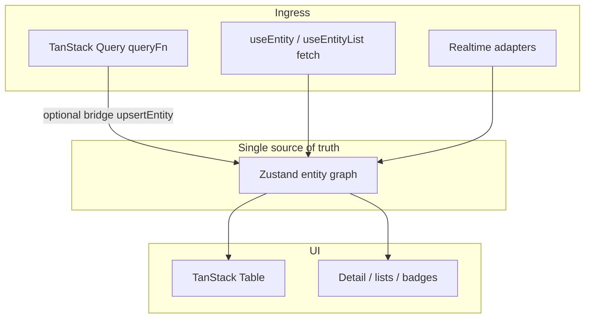

# TanStack Query, TanStack Table, and the entity graph

This document is the **authoritative** mental model for using `@prometheus-ags/prometheus-entity-management` alongside TanStack’s data and table libraries.

## Roles (do not collapse them)

| Layer | Responsibility | Owns |
|--------|----------------|------|
| **TanStack Query** | Async state for a **request**: caching, retries, deduped `queryFn`, background refresh keyed by `queryKey` | The **HTTP lifecycle** and **query-key cache entries** |
| **`@prometheus-ags/prometheus-entity-management`** | Normalized **entity graph**: one canonical `(type, id)` record, list **ID arrays**, patches, engine dedupe/SWR/GC | **Application-wide entity truth** for UI that must stay consistent across routes |
| **TanStack Table** | **Presentation**: column defs, sorting UI, row selection, virtualization hooks | **Table state** (sorting, selection), not your server cache |

You can use **Query without** this library (isolated per-key caches). You can use **this library without** Query (hooks own fetch via the engine). Many apps use **both**: Query for a legacy or third-party data path, and the **graph** as the single place the rest of the UI reads from—after you **bridge** successful Query results into `upsertEntity` / list writers (see the Vite example route **TanStack Query bridge**).

## Why not “just TanStack Query”?

TanStack Query’s cache is **query-key scoped**. Two screens with different keys can hold **two copies** of the same business object unless you manually thread `setQueryData` everywhere. This library’s graph is keyed by **`(entityType, id)`** (and list keys for ordered IDs), so **one** update propagates to every subscriber—lists, detail sheets, badges—without reconciling query keys.

## Where React Table sits

- **Table components** consume **rows** (from `useEntityList` `items`, or from joining `ids` to `readEntity`, or from your bridge).
- **Sorting/filtering in the table header** is UI; **remote** sort/filter still compiles to your API via `FilterSpec` / `SortSpec` and `useEntityView` when you need server-backed lists.
- Optional **column helpers** in `src/ui/columns.tsx` attach `meta.entityMeta` so toolbars can render the right filter controls.

## TanStack DB (optional comparison)

[TanStack DB](https://tanstack.com/db) targets **collections**, sync, and incremental updates in a different product space. This library is a **React entity graph** on Zustand with the same “normalized + reactive” goal but a **smaller, hook-first** surface and first-class **REST / GraphQL / realtime / Electric** patterns. They can be **complementary** (e.g. DB or Query as ingress, graph as app SOT) if you design a single writer path.

## Diagram

## Further reading

- [Advanced topics](./advanced.md) — engine, GC, Suspense, DevTools
- [README § Migration from TanStack Query](../README.md#migration-from-tanstack-query)
