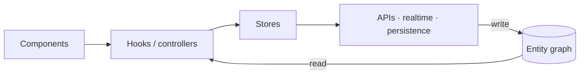

# Layers and data flow

The architecture is strictly layered, and the layering is what keeps one graph
coherent across every framework binding.

## The rules

- **Components** render and submit intent. They consume hooks only — never
  stores directly, never fetch.
- **Hooks / controllers** orchestrate data flow between components and stores.
  They call store methods; they never talk to APIs or external services
  directly.
- **Stores and adapters** own all external communication: REST, GraphQL,
  WebSocket, ElectricSQL, persistence, caching, invalidation, and writes into
  the entity graph.

## Why it matters

Breaking the layering recreates the data silos the graph exists to eliminate:
a component that fetches directly owns a private copy of server state, and
that copy cannot participate in cross-view reactivity.

The rule set is identical across React, Svelte, Solid, Alpine, HTMX, Web
Components, Flutter, and Tauri — only the hook/controller vocabulary changes.
See [Bindings](/docs/guides/bindings/react) for each surface.

## Enforced, not aspirational

These rules ship in `AGENTS.md`, in the skills pack, and in this guide set with
identical wording, and the skills release gate scans for violations.
