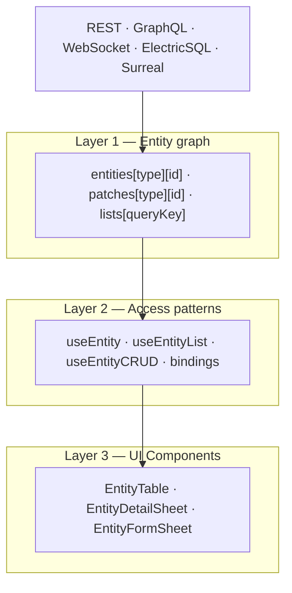

# Architecture

The architecture is strictly layered. Data flows upward into the graph;
components read downward from it. There is no sideways data flow between
components.

## The entity graph

The graph holds three structures:

1. **`entities[type][id]`** — canonical storage for server-confirmed entity
   data. Written only by graph mutations (`upsertEntity`, `replaceEntity`,
   `removeEntity`), never by UI code.
2. **`patches[type][id]`** — local UI-only augmentations such as `_selected`
   or `_loading`. They merge at read time and are never sent to the server.
3. **`lists[queryKey]`** — ordered arrays of entity IDs plus pagination and
   fetching state. **Lists never store entity data.** That single decision is
   what allows every view containing an entity ID to re-render from one graph
   update.

## Data flow rules

- Components consume hooks; they never touch stores or APIs directly.
- Hooks orchestrate store methods; they never perform I/O themselves.
- Stores and adapters own all external communication — fetch, mutation,
  realtime subscriptions, caching, and graph writes.

## Cross-framework by construction

The core is framework-neutral. React, Svelte, Solid, Alpine, HTMX, Web
Components, Flutter, and Tauri bindings are thin singleton facades over the
same graph contract, certified by the six-binding packed contract gate
(`pnpm run verify:binding-singletons`).
