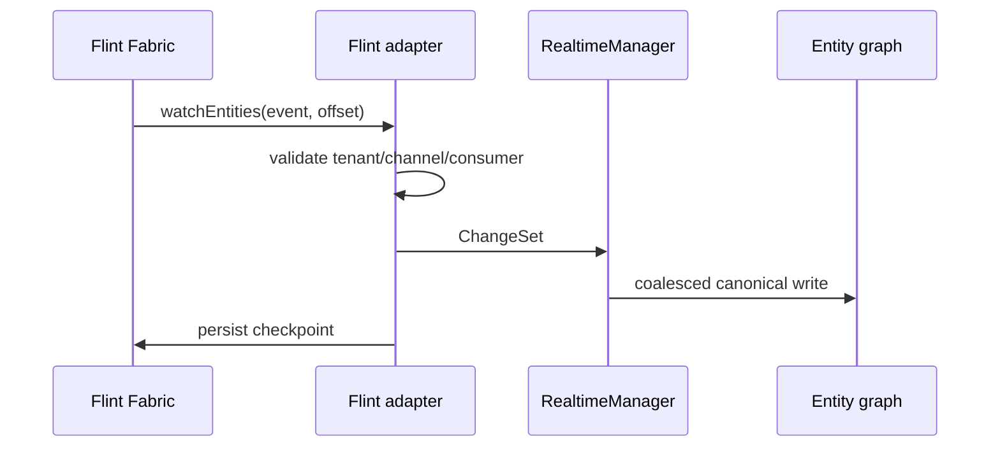

# Event, checkpoint, and trust flow

Resume a consumer from its stored offset, not from UI state. Publish mutations
through `mutateEntity`; do not expose Forge or service-role credentials to
clients. On reconnect, resume from the last acknowledged checkpoint and allow
the manager to collapse repeated entity changes inside its configured window.

The repository proves a deterministic fixture plus immutable sibling-source
contracts. A hosted Flint deployment, Forge adapter, or registry artifact is
not claimed by that evidence.
