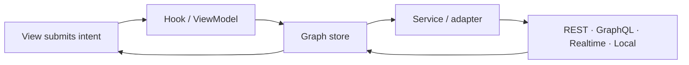

# Start with the graph, not a framework cache

Prometheus Entity Management stores each entity exactly once at a stable
`type + id` address. Queries populate that graph. Lists keep ordered IDs. Views
join those IDs to the current canonical entity plus local patches, so a change
in one workflow is visible everywhere that entity is projected.

## Current release boundary

The active documentation line is **3.x**. React, the framework-neutral core,
and A2UI React are public as `3.0.0-rc.1`; nine integration packages remain
staged pending npm approval. React's `latest` and `next` tags resolve to the RC.
Core and A2UI publish the RC on `next` while retaining their alpha `latest`
tags. Flutter is public as `entity_graph_flutter@3.0.0` on pub.dev. See the
[verified registry snapshot](../packages/index.md) before choosing an install command.

## Choose your next step

- [Understand normalized identity and ID-only lists](../concepts/index.md)
- [Choose a framework binding](../frameworks/index.md)
- [Connect a realtime or local-first integration](../integrations/index.md)
- [Inspect runnable examples and their status](../examples/index.md)
- [Select from the package family](../packages/index.md)
- [Audit the evidence behind public claims](../evidence/index.md)
