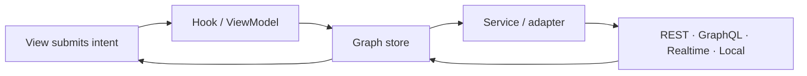

# Start with the graph, not a framework cache

Prometheus Entity Management stores each entity exactly once at a stable
`type + id` address. Queries populate that graph. Lists keep ordered IDs. Views
join those IDs to the current canonical entity plus local patches, so a change
in one workflow is visible everywhere that entity is projected.

## Current release boundary

The active documentation line is **3.x** and the current release is an RC
program. The code and evidence cover all five showcase families at explicitly
recorded levels, but the npm `next` tag is not presented as installable until
registry verification succeeds. The `latest` tags remain unchanged: React is
stable at `2.2.0`, while the other eleven packages remain at `3.0.0-alpha.0`.

## Choose your next step

- [Understand normalized identity and ID-only lists](../concepts/index.md)
- [Choose a framework binding](../frameworks/index.md)
- [Connect a realtime or local-first integration](../integrations/index.md)
- [Inspect runnable examples and their status](../examples/index.md)
- [Select from the package family](../packages/index.md)
- [Audit the evidence behind public claims](../evidence/index.md)
