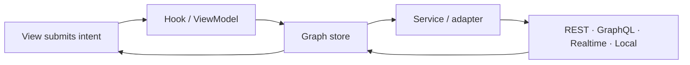

# Start with the graph, not a framework cache

Prometheus Entity Management stores each entity exactly once at a stable
`type + id` address. Queries populate that graph. Lists keep ordered IDs. Views
join those IDs to the current canonical entity plus local patches, so a change
in one workflow is visible everywhere that entity is projected.

## Current release boundary

The active documentation line is **3.x**. All twelve npm packages are public
at stable `3.1.0` on the `latest` tag (published 2026-08-29; the short-lived
`3.0.0` manifests shipped an unresolved `workspace:` protocol and are
deprecated, and `3.0.4` is deprecated because it contained stale build
artifacts). Flutter is public as `entity_graph_flutter@3.0.5` on pub.dev; its
A2UI 1.0-RC showcase uses GenUI 0.10.2. See
the [verified registry snapshot](../packages/index.md) before choosing an
install command.

## Choose your next step

- [Understand normalized identity and ID-only lists](../concepts/index.md)
- [Choose a framework binding](../frameworks/index.md)
- [Connect a realtime or local-first integration](../integrations/index.md)
- [Inspect runnable examples and their status](../examples/index.md)
- [Select from the package family](../packages/index.md)
- [Audit the evidence behind public claims](../evidence/index.md)
